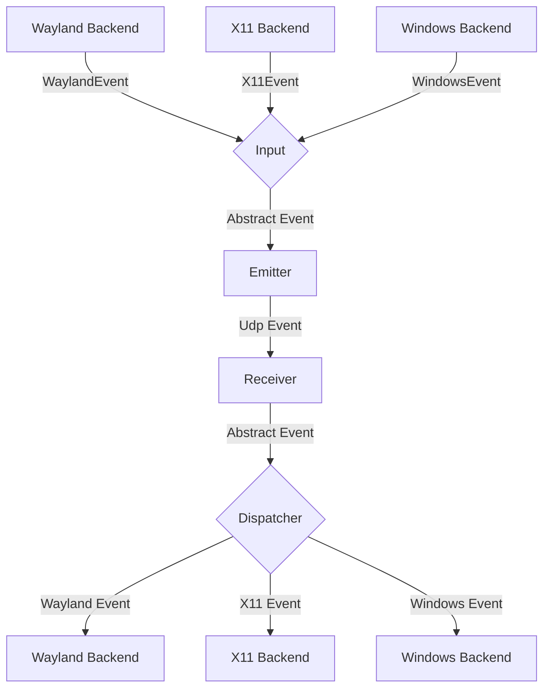
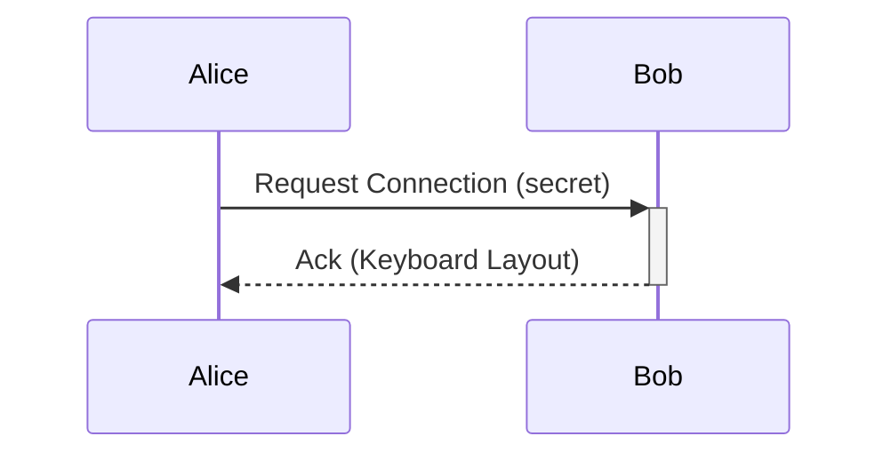

# General Software Architecture

## Events

Each instance of lan-mouse can emit and receive events, where
an event is a mouse event, keyboard event, or negotiated clipboard text update.

The general Architecture is shown in the following flow chart:

### Input
The input component is responsible for translating inputs from a given backend
to a standardized format and passing them to the event emitter.

### Emitter
The event emitter serializes events and sends them over the network
to the correct client.

### Receiver
The receiver receives events over the network and deserializes them into
the standardized event format.

### Dispatcher
The dispatcher component takes events from the event receiver and passes them
to the correct backend corresponding to the type of client.

### macOS keyboard modifiers

macOS reports modifier keys through `FlagsChanged`, and Caps Lock represents a logical lock edge
rather than a held key. The capture backend forwards Caps Lock as a complete pulse and keeps locked
state separate from depressed modifiers. The emulation backend posts key-specific `FlagsChanged`
events, never puts modifiers into key repeat, and reconciles only actual snapshot differences. An
immediate modifier snapshot after the Enter acknowledgement plus periodic snapshots recover lost
modifier releases without injecting duplicate keycode-0 events into AppKit or an active IME.

### Clipboard

The service uses separate platform reader and writer threads and forwards changed UTF-8 text to
authenticated peers. A slow platform read never delays an incoming remote write, and a generation
check discards stale reads that overlap a write. On macOS, the reader checks
`NSPasteboard.changeCount` before materializing clipboard data so an unchanged Universal Clipboard
is not fetched every polling interval. Pasteboard entries carrying Apple's
`com.apple.is-remote-clipboard` Handoff marker are consumed without reading their contents; the
CrossDesk network packet supplies that text instead, so polling cannot trigger macOS's remote-paste
progress window. Successful remote writes update the last-seen value, which
prevents the same text from bouncing between devices. A remote value that encounters a busy native
clipboard remains pending and is retried until it succeeds, synchronization is disabled, or a newer
value replaces it. Clipboard packets are limited to 16 KiB and are sent only after the peer
advertises the clipboard capability in the backward-compatible Hello exchange. Platform clipboard
access never runs on the input capture, emulation, or GUI thread.

## Requests

// TODO this currently works differently

Aside from events, requests can be sent via a simple protocol.
For this, a simple tcp server is listening on the same port as the udp
event receiver and accepts requests for connecting to a device or to
request the keymap of a device.

## Problems
The general Idea is to have a bidirectional connection by default, meaning
any connected device can not only receive events but also send events back.

This way when connecting e.g. a PC to a Laptop, either device can be used
to control the other.

It needs to be ensured, that whenever a device is controlled the controlled
device does not transmit the events back to the original sender.
Otherwise events are multiplied and either one of the instances crashes.

To keep the implementation of input backends simple this needs to be handled
on the server level.

## Device control role
To solve this problem, the daemon owns one mutually exclusive control session:
`Idle`/`ReadyToReceive`, `Controlling`, `ControlledBy`, or `Switching`. A shared
atomic arbiter is acquired by capture or emulation before Enter is acknowledged,
so events can never be sent and received at the same time even when both devices
cross an edge concurrently.

The configured mode (`bidirectional`, `send_only`, or `receive_only`) is enforced
by the same arbiter; asynchronous barrier/listener updates are not the safety
boundary. New peers advertise the control-session capability in Hello and use a
generation serial in Enter/Input/Leave/Ack, with a distinct close phase, so
delayed datagrams cannot inject into, confirm, or end a later session. Legacy
peers retain the original serial-0 handshake and roll the DTLS epoch on close.

This ensures that
- a) Events can never result in a feedback loop.
- b) As soon as a virtual input enters another client, lan-mouse will stop receiving events,
which ensures clients can only be controlled directly and not indirectly through other clients.
